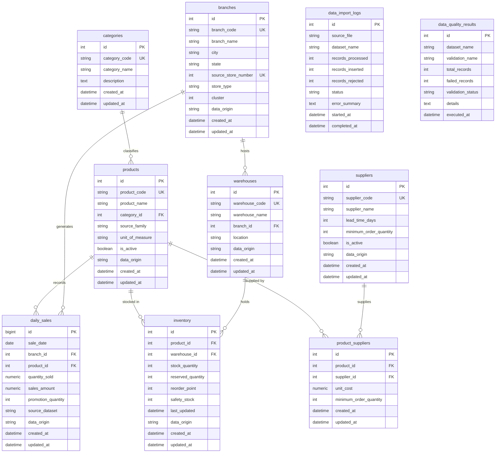

# SmartDist AI — Entity-Relationship Diagram (ERD)

This document visualizes the complete normalized relational schema powering SmartDist AI, established in Phase 2.

```mermaid
erDiagram
    categories ||--o{ products : "classifies"
    products ||--o{ daily_sales : "records"
    products ||--o{ inventory : "stocked in"
    products ||--o{ product_suppliers : "supplied by"
    suppliers ||--o{ product_suppliers : "supplies"
    branches ||--o{ daily_sales : "generates"
    branches ||--o{ warehouses : "hosts"
    warehouses ||--o{ inventory : "holds"

    categories {
        int id PK
        string category_code UK
        string category_name
        text description
        datetime created_at
        datetime updated_at
    }

    products {
        int id PK
        string product_code UK
        string product_name
        int category_id FK
        string source_family
        string unit_of_measure
        boolean is_active
        string data_origin
        datetime created_at
        datetime updated_at
    }

    branches {
        int id PK
        string branch_code UK
        string branch_name
        string city
        string state
        int source_store_number UK
        string store_type
        int cluster
        string data_origin
        datetime created_at
        datetime updated_at
    }

    warehouses {
        int id PK
        string warehouse_code UK
        string warehouse_name
        int branch_id FK
        string location
        string data_origin
        datetime created_at
        datetime updated_at
    }

    suppliers {
        int id PK
        string supplier_code UK
        string supplier_name
        int lead_time_days
        int minimum_order_quantity
        boolean is_active
        string data_origin
        datetime created_at
        datetime updated_at
    }

    product_suppliers {
        int id PK
        int product_id FK
        int supplier_id FK
        numeric unit_cost
        int minimum_order_quantity
        datetime created_at
        datetime updated_at
    }

    inventory {
        int id PK
        int product_id FK
        int warehouse_id FK
        int stock_quantity
        int reserved_quantity
        int reorder_point
        int safety_stock
        datetime last_updated
        string data_origin
        datetime created_at
        datetime updated_at
    }

    daily_sales {
        bigint id PK
        date sale_date
        int branch_id FK
        int product_id FK
        numeric quantity_sold
        numeric sales_amount
        int promotion_quantity
        string source_dataset
        string data_origin
        datetime created_at
        datetime updated_at
    }

    data_import_logs {
        int id PK
        string source_file
        string dataset_name
        int records_processed
        int records_inserted
        int records_rejected
        string status
        text error_summary
        datetime started_at
        datetime completed_at
    }

    data_quality_results {
        int id PK
        string dataset_name
        string validation_name
        int total_records
        int failed_records
        string validation_status
        text details
        datetime executed_at
    }
```
